# Carrier Credential & Access Management POC Architecture

**Source basis:** `source-material/requirements.md`, `source-material/problem-articulation.md`, `source-material/transcript-2026_06_12_10_59_EDT.txt`, and `source-material/background-research/findings.md`.

**Implementation status:** A working reference implementation now exists in `poc-ts-app/` (browser-based TypeScript SPA). It demonstrates the lifecycle model, credential trust tiers, MFA relay, carrier-adapter modes, a per-carrier provider catalog, and a supervised browser-based RPA portal-automation demo. See [Reference Implementation](#reference-implementation-poc-ts-app) for how the built app maps to this architecture.

## Executive Summary

Alex's core need is a broker-controlled system for managing carrier portal access across many carriers: onboarding, offboarding, admin-of-record continuity, access levels, credential/session handling, MFA, and carrier-specific process knowledge.

The POC should prove a hybrid architecture:

- **Immediate value:** a unified broker workspace for carrier access inventory, user lifecycle requests, role mapping, SOP-guided workflows, credential/session handling, MFA relay, and audit trails.
- **Near-term automation:** carrier adapters that execute or assist the common provisioning/deprovisioning patterns for a focused set of top carriers.
- **Durable path:** carrier-sanctioned API/federation integrations where carriers participate, avoiding long-term dependence on credential replay.
- **RPA demo track:** supervised, broker-assisted RPA in guided portal adapter mode for deterministic pilot-carrier flows, with explicit user checkpoints.

For Alex's pilot, the target is not full B&B or full market coverage. The POC should prioritize **top 5 portals plus the next 7 high-value carriers** from the 40-50 active carrier portals his office uses.

## Architecture Drivers

| Driver | Implication |
|---|---|
| Broker-first control | Licensed broker/admin remains accountable and confirms lifecycle actions. |
| Carrier inconsistency | Model carriers as configurable playbooks and adapters, not hard-coded flows. |
| MFA is unavoidable | Relay MFA challenges to the user/admin instead of bypassing or weakening MFA. |
| Trust spectrum | Support enter-every-time, session-cached, and stored-registry credential modes. |
| Admin continuity | Track admin-of-record per carrier and alert before access becomes orphaned. |
| Auditability | Every credential, access, admin, and MFA action must be logged. |
| Legal/regulatory risk | Prefer sanctioned APIs/federation where possible; keep broker-in-the-loop for portal automation. |
| Price sensitivity | Start with a narrow, high-value POC and reusable carrier configuration. |

## POC Scope

### In Scope

- Broker office setup for Brown & Brown Central Florida commercial lines.
- Broker users, roles, teams, and carrier access matrix.
- Carrier catalog for approximately 12 pilot carriers.
- Per-carrier access-level normalization:
  - View-only
  - Quoting
  - Administrative
- Admin-of-record tracking per carrier and office.
- Provisioning, deprovisioning, and admin-transfer workflows.
- Carrier process playbooks loaded from SOPs/spreadsheets.
- Credential handling with three trust tiers:
  - Enter every time
  - Cached session
  - Stored registry
- MFA challenge relay back to the responsible user.
- Audit log, task status, exception queue, and evidence capture.
- Knowledge assistant for "How do I get access for carrier X?"

### Out of Scope for POC

- Full Brown & Brown enterprise rollout.
- Coverage for all 40-50 active carriers on day one.
- Full quoting, binding, or servicing workflow automation.
- Automated evasion of carrier bot detection.
- Full unattended browser control without user checkpoints.
- Any design that assumes carrier MFA can be skipped.
- Carrier network monetization, except as a future-state architectural path.

## System Context

This diagram shows the POC boundary: broker users and compliance teams interact with DataBraid, while DataBraid connects to the broker IdP, imported SOPs, carrier portals, carrier support channels, future sanctioned carrier integrations, secrets infrastructure, and notifications. The integration posture is explicit:
- **API/federation mode:** DataBraid sends lifecycle payloads to carriers and receives confirmations directly.
- **Portal mode:** DataBraid launches a broker-controlled session and runs a scripted, broker-assisted portal flow, with user confirmation remaining mandatory at critical steps.

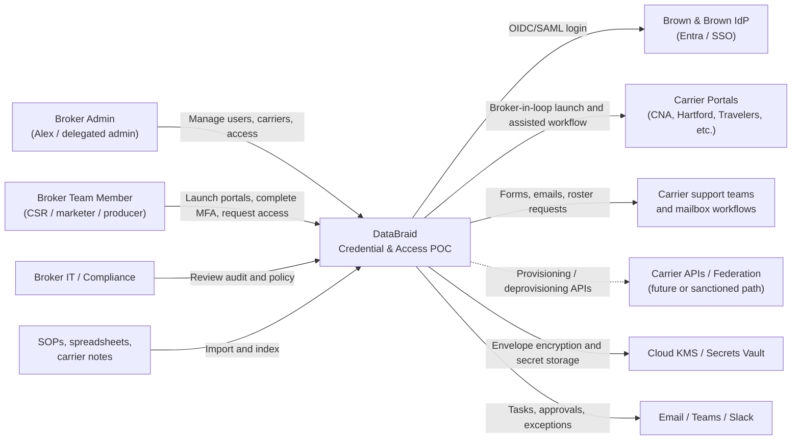

## Container Architecture

This diagram decomposes the POC into runtime services, data stores, browser-side components, and external systems, showing how lifecycle orchestration, credential handling, MFA relay, carrier adapters, knowledge search, audit, and notifications fit together.

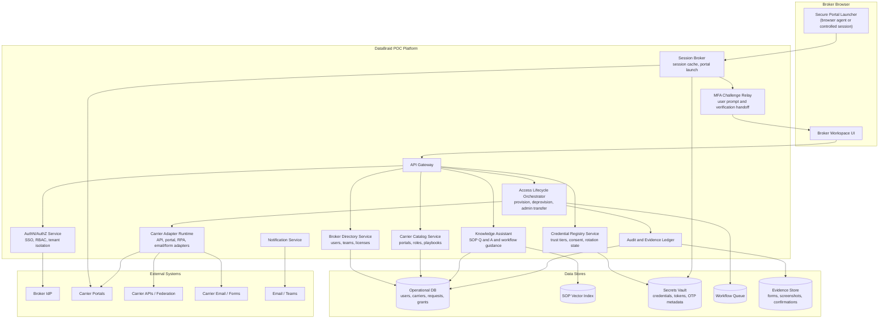

## Core Domain Model

This diagram captures the main business entities the POC must track: broker offices, users, carrier appointments, portals, carrier playbooks, access requests, grants, credentials, MFA challenges, admin assignments, SOP documents, and audit events.

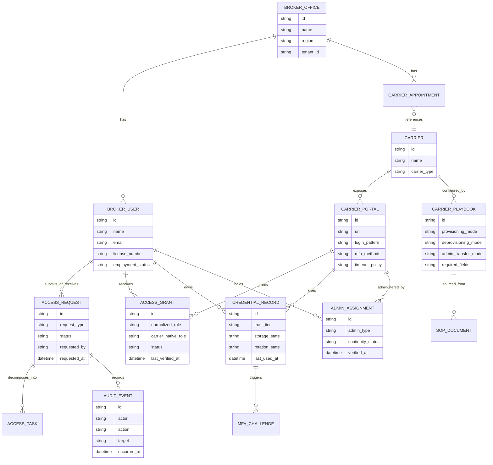

## Provisioning Flow

This sequence shows how a broker admin can add a teammate once, select carrier access, and let DataBraid split that request into carrier-specific API, guided portal, or email/form provisioning tasks with audit evidence and status notifications.

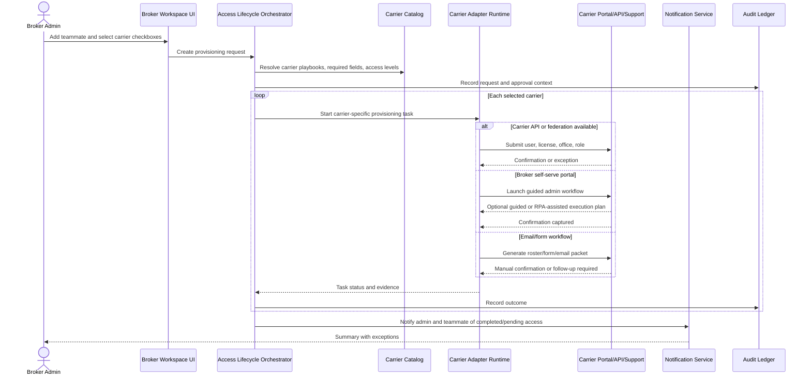

## Deprovisioning Flow

This sequence shows the offboarding path: DataBraid first disables local credential/session access, then coordinates revocation across each carrier through API, guided admin workflow, or carrier support request, while tracking confirmations and exceptions.

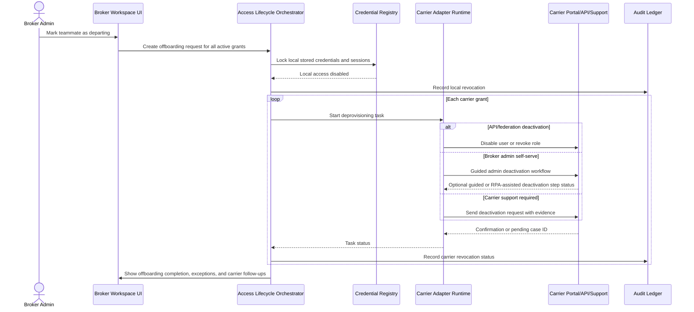

## Credential Sharing and Integration Handover (How this is shown)

The POC answers the credentials-sharing question with two explicit handoff modes:

- **Storage:** credentials or short-lived sessions remain in the Secrets Vault and are keyed by user/carrier trust policy.
- **Handover:** credentials/sessions are released only into a signed, user-bound launch context.
- **No leak path:** task records store only references; they do not persist credential plaintext.

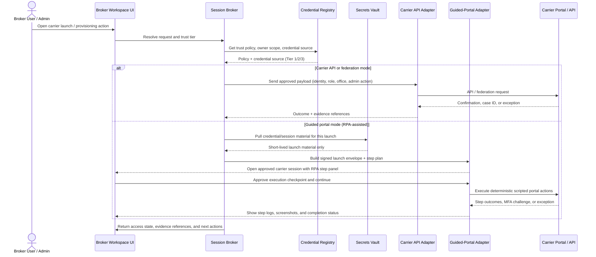

## Credential Trust Tiers and MFA Handling

This diagram shows the three credential-handling modes and the common MFA path: users may enter credentials each time, use a short-lived cached session, or use stored credentials from the vault, but carrier MFA challenges are still relayed back to the responsible user.

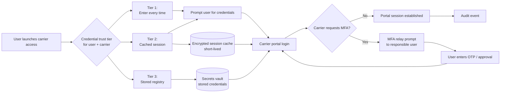

### Trust Tier Semantics

| Tier | Behavior | Best for |
|---|---|---|
| Tier 1: Enter every time | DataBraid stores nothing. User enters credentials at launch. | High-sensitivity carriers, initial trust-building, strict compliance posture. |
| Tier 2: Cached session | Credentials/session material is retained only in short-lived encrypted memory/cache. | Daily workflow relief without long-term credential storage. |
| Tier 3: Stored registry | Credentials are stored in a vault and auto-applied; MFA is relayed to the user. | High-volume portals where broker accepts storage risk. |

## Admin-of-Record Continuity

This diagram shows the control loop for preventing orphaned carrier admins: DataBraid inventories admin assignments, verifies whether admins are still active and backed up, flags continuity risks, and drives transfer workflows with evidence and reminders.

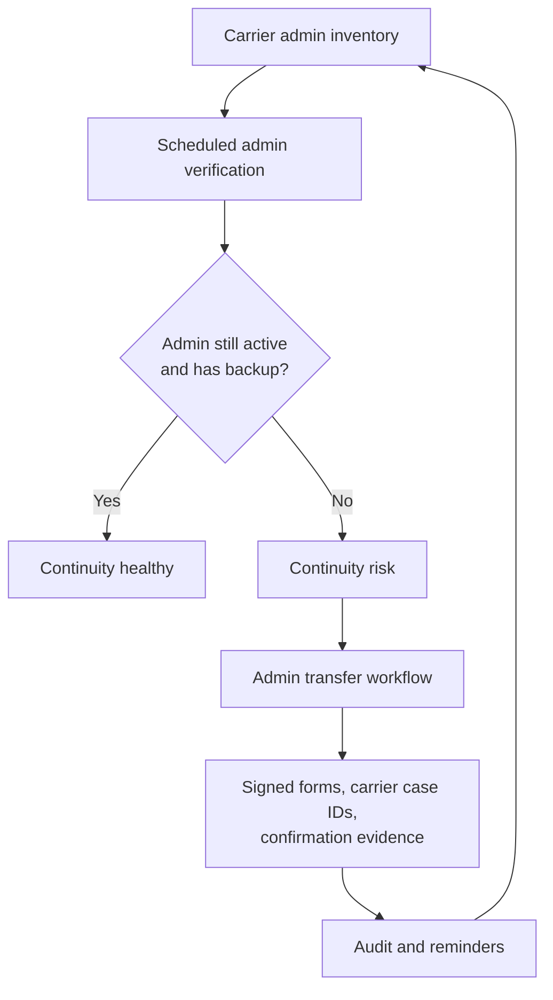

The POC should require at least two designated internal admins for every pilot carrier where the carrier supports it. If a carrier only allows one admin, the system should flag that carrier as a continuity risk and keep an explicit transfer playbook.

## Carrier Adapter Strategy

Each pilot carrier is represented by a configurable carrier package. The package should separate **metadata** from **execution** so DataBraid can add carriers without rewriting the platform.

This diagram shows the carrier package structure: each package combines portal metadata, lifecycle playbooks, execution adapters, and evidence rules, with adapters selected based on whether the carrier supports APIs, self-serve portals, email/forms, or manual tasks.

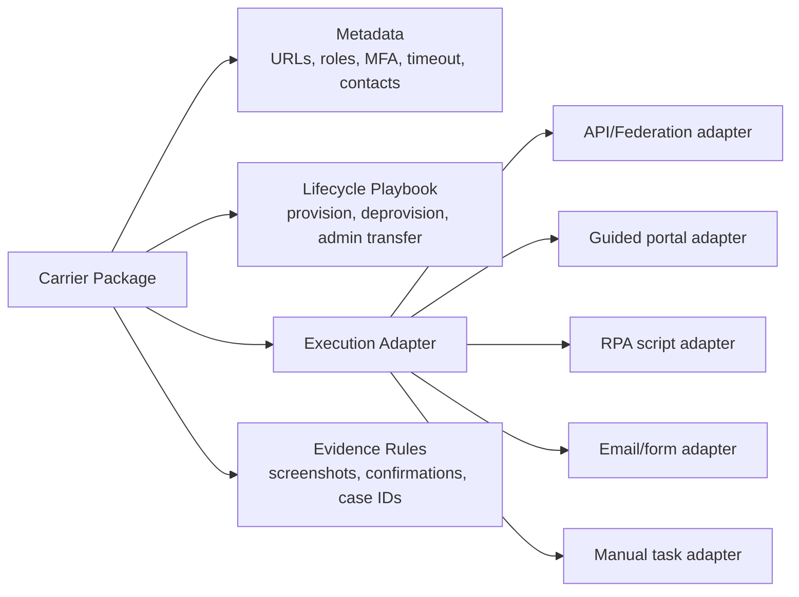

### Adapter Modes

| Mode | Description | POC Use |
|---|---|---|
| API/federation adapter | Uses sanctioned carrier endpoint or identity federation. | Preferred where available. |
| Guided portal adapter | Opens the carrier admin portal and executes constrained scripts with user checkpoints in a supervised session. | Practical near-term automation while keeping broker in control. |
| RPA script adapter | Executes deterministic, scriptable provisioning/deprovisioning steps where carrier pages are stable. | Demonstration-grade automation for pilot carriers without APIs. |
| Email/form adapter | Generates carrier-specific emails, rosters, and signed forms. | Handles carriers without self-serve admin functions. |
| Manual task adapter | Creates checklist tasks and captures evidence. | Keeps long-tail carriers visible without pretending they are automated. |

## Knowledge Assistant

This diagram shows how Alex's spreadsheets, SOPs, carrier notes, and email templates become searchable operational knowledge that can answer carrier-access questions and optionally create lifecycle tasks from the answer.

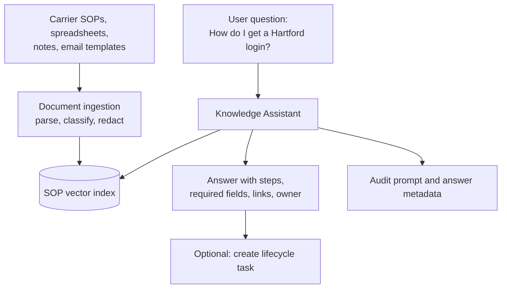

The assistant is secondary to lifecycle automation but useful for the POC because it converts Alex's tribal spreadsheet into shared operational knowledge.

## Deployment View

This diagram shows a practical cloud deployment shape for the POC: broker browsers enter through API protection into DataBraid services, while workflow workers and isolated carrier adapters connect outward to carrier portals, APIs, and support mailboxes; secrets, evidence, logs, queueing, and indexes are managed services.

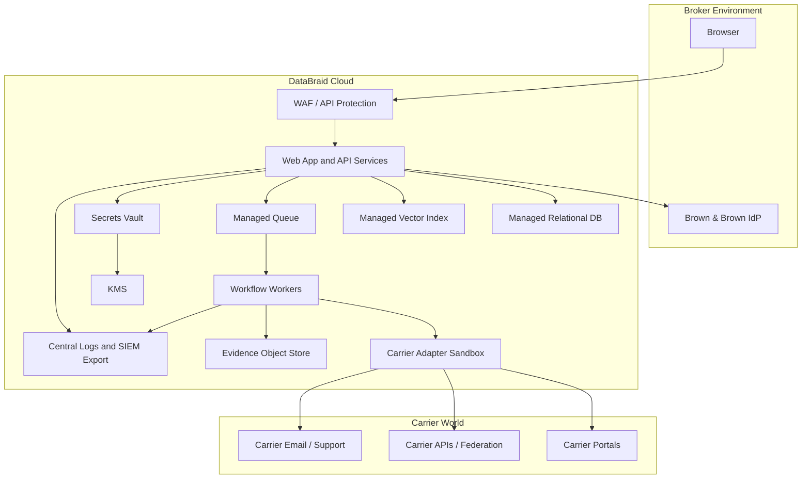

## Security and Compliance Controls

- **Tenant isolation:** all users, carriers, credentials, and evidence are scoped to a broker office/tenant.
- **SSO first:** authenticate broker users through the broker IdP where available.
- **RBAC:** separate team member, broker admin, compliance reviewer, and DataBraid support roles.
- **Consent records:** store explicit consent for trust tier, carrier, and credential-owner scope.
- **Encryption:** encrypt data in transit and at rest; use envelope encryption for secrets.
- **Secrets isolation:** credentials and token material live only in the secrets vault or short-lived session cache.
- **MFA relay:** MFA is completed by the user/admin, not bypassed.
- **RPA governance:** RPA scripts run in supervised mode only, require explicit confirmation at critical actions, and capture execution screenshots/evidence.
- **Audit ledger:** record lifecycle requests, approvals, credential use, MFA events, adapter actions, and evidence.
- **Least privilege:** normalize access roles and map them to minimum required carrier-native roles.
- **Break-glass workflow:** require elevated approval and audit evidence for emergency admin access.
- **Retention policy:** define credential, session, evidence, and SOP retention separately.
- **Carrier ToS posture:** prefer sanctioned integrations; use guided broker-in-loop workflows where sanctioned APIs do not exist.

## Reference Implementation (`poc-ts-app/`)

A runnable proof-of-concept lives in `poc-ts-app/`. It is a single-page TypeScript application with no backend: all state lives in the browser, the workflow engine runs client-side, and mock carrier portals are served as static pages. This keeps the demo safe and deterministic — it never calls real carrier endpoints and persists nothing outside the browser.

### What it is (and is not)

- **It is** a faithful demonstration of the lifecycle model, trust tiers, MFA relay, adapter modes, provider catalog, and a supervised RPA portal-automation flow.
- **It is not** the production architecture rendered above. Several server-side services in the [Container Architecture](#container-architecture) are collapsed into client-side modules for the demo:

| Architecture concept | Demo realization |
|---|---|
| Operational DB, Secrets Vault, Queue, Evidence/Object Store | Browser `localStorage` (single state blob, key `bb-credential-poc-state-v1`). |
| Access Lifecycle Orchestrator, Credential Registry, Session Broker, MFA Relay | `src/engine.ts` pure functions (`provisionTeammate`, `deprovisionTeammate`, `launchCarrierAccess`, `completePendingTask`, `evaluateContinuity`, `searchKnowledge`). |
| Carrier Adapter Runtime + per-carrier outcomes | `taskOutcomeForCarrier` deterministic outcome simulation by adapter mode; mock portal pages under `carrier-portals/`. |
| Carrier API / federation, carrier mailbox | Simulated task outcomes; no live integrations. |
| Secrets vault encryption | `btoa` encoding placeholder — illustrative only, not real envelope encryption. |
| SOP Vector Index / Knowledge Assistant | Seeded `KnowledgeDoc` set with substring scoring in `searchKnowledge`. |

### Implemented workspace views

The app (`src/app.ts`) presents these views, each tagged with the `R#`/`N#` requirements it demonstrates:

- **Alex Map** — requirements-to-screen translation for R1–R7 and N1–N6.
- **Overview** — workspace launcher, pending queue, and a recent-requests sample.
- **Provision** — add a teammate once, check carrier boxes, and set per-carrier role and trust tier; one request fans out into carrier-specific tasks.
- **Users** — per-user access inventory, offboarding, and carrier launch (launch is restricted to the currently signed-in user; admins offboard others).
- **Requests** — lifecycle request/task evidence trail with per-carrier task status.
- **Providers** — full CRUD over the carrier catalog: portal URL, adapter mode, API support, auth mechanism, MFA method, default trust tier, and timeout.
- **Pending** — operational queue of tasks needing broker confirmation (portal/email/manual adapter outcomes).
- **Knowledge** — search over seeded carrier SOP notes.
- **Continuity** — admin-of-record risk findings per carrier.

### Browser-based RPA portal-automation demo

The most recent addition is a supervised RPA demonstration of the guided-portal adapter mode, replacing an earlier `window.prompt` credential flow:

- **Inline launch panel** in the workspace collects credentials (or auto-launches from a cached session / saved login), then relays MFA when the carrier requires it — no credentials are persisted in task records.
- **Mock carrier portal** (`carrier-portals/mock-carrier-portal.js`) opens in a new window and renders a carrier-branded login whose form shape varies by `authMechanism` (`credentials`, `oauth`, `sso_redirect`, `email_code`, `phone_code`).
- **RPA overlay** shows DataBraid automating the login: character-by-character typing into the username/password/OTP fields, a visible step log, then submission.
- **Authenticated dashboard** is shown after a successful simulated login, standing in for the carrier session the broker would work in directly.
- **Session reuse** — Tier 2 launches extract the username from the cached token and skip credential re-entry until timeout.

This is demonstration-grade automation: it runs against the mock portals only, keeps the broker in the loop at credential and MFA checkpoints, and is consistent with the **RPA governance** posture in [Security and Compliance Controls](#security-and-compliance-controls).

### Seed data

The seed (`src/seed.ts`) ships **12 pilot carriers** spanning all adapter modes and auth mechanisms (CNA, The Hartford, Travelers, Monoline Work Comp, AMN/AFLAC, Liberty Mutual, State Farm, Hiscox, Berkshire Hathaway, Chubb, Endeavor, Axiom Risk), three seeded broker users (including Alex Metka as broker admin), seeded grants, admin-of-record assignments, and a small knowledge-note set.

### Running and testing

- `npm run build` compiles TypeScript; `npm start` serves the app at `http://127.0.0.1:4173`.
- `playwright-smoke.js` is a headless smoke test covering provision → requests → offboard → launch panel → continuity → knowledge → localStorage persistence.

## Requirement Coverage

| Requirement | POC Capability |
|---|---|
| R1 Provisioning | Add teammate once, select carriers, orchestrate carrier-specific tasks. |
| R2 Deprovisioning | Departing-user workflow disables local access and tracks carrier revocation. |
| R3 Admin continuity | Admin inventory, backup admin tracking, transfer workflows, continuity alerts. |
| R4 Access levels | Normalized roles mapped to carrier-native role options. |
| R5 Login automation / unified sign-on | Inline launch panel, credential trust tiers, session cache, saved login, MFA relay, and supervised browser-based RPA against mock portals (implemented in `poc-ts-app`). |
| R6 Carrier inconsistency | Carrier catalog with Providers CRUD, playbooks, adapter modes, per-mode task outcomes, evidence rules. |
| R7 Knowledge assistance | SOP ingestion, vector search, Q&A, task creation from answers. |
| N1 Security/trust spectrum | Tier 1/2/3 credential handling. |
| N2 Broker stays in control | Broker admin approvals and guided workflows. |
| N3 MFA handled | MFA relay is a first-class component. |
| N4 Carrier-agnostic breadth | Adapter pattern supports APIs, portals, forms, and manual tasks. |
| N5 Price-sensitive buyer | Narrow top-carrier POC, reusable carrier packages, no enterprise-wide dependency. |
| N6 Jurisdiction/line-agnostic | Core lifecycle model is independent of FL/ON and commercial/personal lines. |

## POC Implementation Phases

### Phase 1: Access Inventory and Carrier Catalog

- Import Alex's spreadsheet/SOPs.
- Configure pilot carriers, portals, roles, admins, and provisioning modes.
- Build carrier access matrix by user and carrier.
- Produce stale access and orphaned-admin reports.

### Phase 2: Lifecycle Orchestration

- Add onboarding, offboarding, and admin-transfer request flows.
- Implement workflow queue, status tracking, notifications, and audit events.
- Add email/form adapter for carriers requiring carrier support.

### Phase 3: Credential and MFA POC

- Add trust-tier policy per user/carrier.
- Implement secure portal launcher for Tier 1 and Tier 2.
- Add stored registry for selected low-risk/high-value pilot carriers.
- Add MFA relay and session timeout handling.
- Add supervised RPA flow runner for deterministic carrier portal actions.

### Phase 4: Pilot Carrier Adapters

- Build carrier packages for top 5 confirmed portals.
- Extend to approximately 12 carriers if the first group validates value.
- Capture per-carrier evidence, exceptions, and maintenance burden.
- Author baseline RPA scripts for carriers where the portal flow is stable and low risk.

### Phase 5: Carrier-Sanctioned Path

- Identify carriers willing to support API/federated provisioning.
- Promote API/federation adapter mode as preferred for participating carriers.
- Use pilot usage data to support a carrier-side value proposition.

## POC Success Metrics

- Time to onboard a teammate across selected carriers.
- Time to offboard a teammate across all active grants.
- Number of orphaned/stale carrier users found.
- Percent of pilot carriers with current admin-of-record and backup admin.
- Percent of lifecycle tasks completed without Alex-specific tribal knowledge.
- Number of MFA challenges successfully relayed.
- Number of RPA-assisted carrier tasks completed with user checkpoints.
- Reduction in repeated credential entry for Tier 2/Tier 3 carriers.
- Number of carriers supported by reusable packages.
- Exceptions by carrier and adapter mode.

## Key Open Decisions

- Confirm Alex's exact top 5 carriers and next 7 pilot carriers.
- Decide which carriers are safe candidates for Tier 3 stored credentials.
- Decide whether the portal launcher is browser-extension based, remote-browser based, or both.
- Define which portal actions are allowed in supervised RPA scripts and required checkpoint granularity.
- Confirm Brown & Brown IdP availability for the POC office.
- Define legal/compliance wording for broker consent and carrier ToS posture.
- Decide retention period for portal evidence and access audit events.
